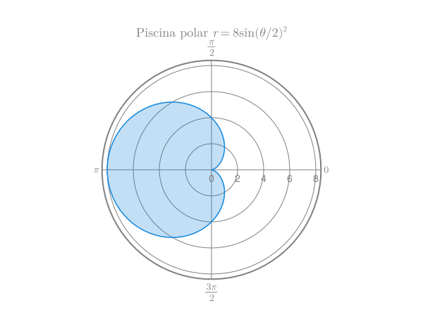
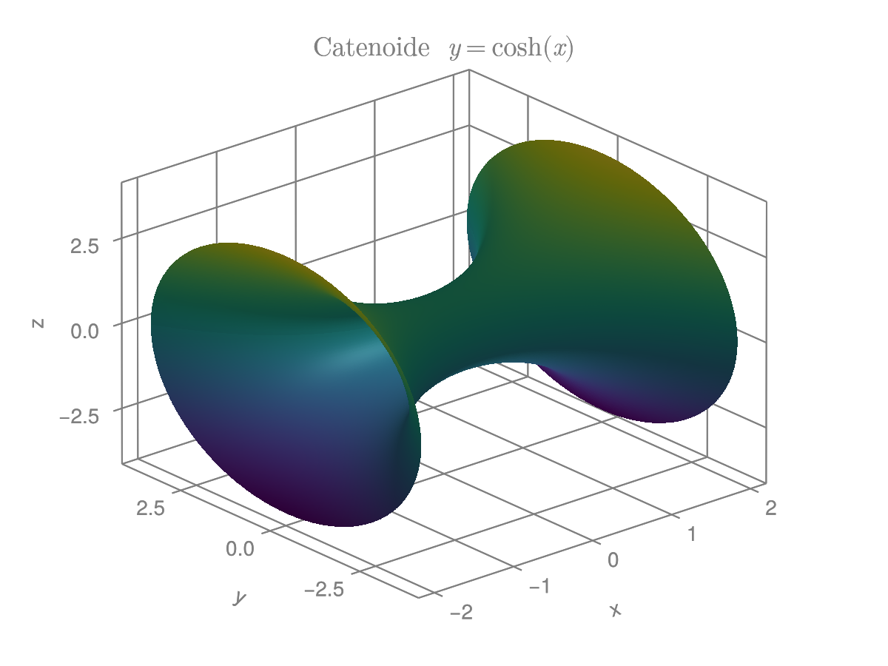

:::{#exr-1}
Una piscina tiene la forma de la curva polar $r(\theta) = 8\operatorname{sen}(\theta/2)^2$ con unidades en metros. ¿Qué cantidad de lona se necesita para cubrir la piscina?
:::

:::{.callout-tip collapse="true"}
## Solución
Para determinar la cantidad de lona que se necesita para cubrir la piscina, debemos calcular el área de la región delimitada por la curva polar dada. La integral que nos da ese area es:

{width=600px}

\begin{align*}
A &= \frac{1}{2} \int_0^{2\pi} r(\theta)^2 \, d\theta \\
&= \frac{1}{2} \int_0^{2\pi} (8\operatorname{sen}(\theta/2)^2)^2 \, d\theta \\
&= 32 \int_0^{2\pi} \left(\frac{1 - \cos(\theta)}{2}\right)^2 \, d\theta \\
&= 8 \int_0^{2\pi} (1 - 2\cos(\theta) + \cos^2(\theta)) \, d\theta \\
&= 8 \left( \int_0^{2\pi} 1 \, d\theta - 2\int_0^{2\pi} \cos(\theta) \,d\theta + \int_0^{2\pi} \cos^2(\theta) \, d\theta \right) \\
&= 8 \left(\left[\theta\right]_0^{2\pi} - 2 \left[\sin(\theta)\right]_0^{2\pi} + \left[\frac{\theta}{2} + \frac{\sin(2\theta)}{4}\right]_0^{2\pi} \right) \\
&= 8 \left[ 2\pi - 0 + \pi \right] \\
&= 24\pi \text{ m}^2.
\end{align*}
:::

:::{#exr-2}
Un catenoide es un tipo de superficie que se obtiene al rotar una catenaria alrededor de su directriz. Calcular el área de la superficie que se forma al rotar la curva catenaria dada por la ecuación $y=a\cosh\left(\frac{x}{a}\right)$ alrededor del eje $x$ entre $x=-b$ y $x=b$, donde $a$ y $b$ son constantes positivas.
:::

:::{.callout-tip collapse="true"}
## Solución

{width=600px}

El area de la superficie de revolución generada al rotar alrededor del eje $x$ la curva catenaria $f(x)=a\cosh\left(\frac{x}{a}\right)$ en el intervalo $[-b,b]$ viene dada por la integral

\begin{align*}
A &= 2\pi \int_{-b}^b f(x) \sqrt{1 + (f'(x))^2} \, dx \\
&= 2\pi \int_{-b}^b a\cosh\left(\frac{x}{a}\right) \sqrt{1 + \operatorname{senh}\left(\frac{x}{a}\right)^2} \, dx \\
&= 2\pi \int_{-b}^b a\cosh\left(\frac{x}{a}\right) \sqrt{ \cosh\left(\frac{x}{a}\right)^2} \, dx \\
&= 2\pi \int_{-b}^b a\cosh\left(\frac{x}{a}\right) \cosh\left(\frac{x}{a}\right) \, dx \\
&= 2\pi a \int_{-b}^b \cosh\left(\frac{x}{a}\right)^2 \, dx \\
&= 2\pi a \int_{-b}^b \frac{1 + \cosh\left(\frac{2x}{a}\right)}{2} \, dx \\
&= \pi a \int_{-b}^b 1 \, dx + \pi a \int_{-b}^b \cosh\left(\frac{2x}{a}\right) \, dx \\
&= \pi a \left[ x \right]_{-b}^b + \pi a \left[\frac{a}{2} \sinh\left(\frac{2x}{a}\right)\right]_{-b}^b \\
&= 2\pi a b + \pi a^2 \sinh\left(\frac{2b}{a}\right).
\end{align*}
:::

:::{#exr-3}
Calcular el centroide de la región homogénea limitada por la función $f(x) = \operatorname{arccos}(x)$ y el eje $x$ en el intervalo $[0, 1]$.

Calcular el volumen de los sólidos de revolución obtenidos al rotar esta región alrededor de los ejes $x$ e $y$, respectivamente.
:::

:::{.callout-tip collapse="true"}
## Solución
En primer lugar, calculamos el área de la región limitada por la función $f(x) = \operatorname{arccos}(x)$ y el eje $x$ en el intervalo $[0, 1]$. El área se calcula mediante la integral

$$
A = \int_0^1 \operatorname{arccos}(x) \, dx.
$$

Sin embargo, la función $\operatorname{arccos}(x)$ no tiene una primitiva fácil, por lo que integraremos su inversa $f^{-1}(y) = \cos(y)$ sobre el intervalo $[f(1), f(0)] = [\operatorname{arccos}(1), \operatorname{arccos}(0)] = [0, \pi/2]$ del eje $y$,

$$
\int_0^{\pi/2} \cos(y) \, dy = \left[\sin(y)\right]_0^{\pi/2} = 1.
$$

El momento con respecto al eje $x$ se calcula mediante la integral

\begin{align*}
M_x &= \int_0^{\pi/2} y\cos(y) \, dy \\
&= y\operatorname{sen}(y) - \int_0^{\pi/2} \operatorname{sen}(y) \, dy \tag{partes}\\ 
&= \left(y\sin(y) + \cos(y)\right)_0^{\pi/2} \\
&= \frac{\pi}{2} - 1
\approx 0.5708.
\end{align*}

Y el momento con respecto al eje $y$ se calcula mediante la integral

\begin{align*}
M_y &= \int_0^{\pi/2} \frac{\cos(y)^2}{2} \, dy \\
&= \int_0^{\pi/2} \frac{1 + \cos(2y)}{4} \, dy \\
&= \left(\frac{y}{4} + \frac{\sin(2y)}{8}\right)_0^{\pi/2} \\
&= \frac{\pi}{8}
\approx 0.3927.
\end{align*}

Por tanto las coordenadas del centroide son

\begin{align*}
\bar{x} &= \frac{M_y}{A} = \frac{\pi/8}{1} = \frac{\pi}{8} \approx 0.3927, \\
\bar{y} &= \frac{M_x}{A} = \frac{\pi/2 - 1}{1} = \frac{\pi}{2} - 1 \approx 0.5708.
\end{align*}

Para calcular el volumen del sólido de revolución obtenido al rotar la región alrededor del eje $x$ lo más sencillo es usar el teorema de Pappus, que nos dice que el volumen es igual al área de la región multiplicada por la distancia recorrida por el centroide al rotar alrededor del eje $x$, que es un círculo de radio $\bar{y}$, es decir, 

$$
V_x = A \cdot 2\pi \bar{y} = 1 \cdot 2\pi \left(\frac{\pi}{2} - 1\right) = \pi^2 - 2\pi \approx 3.5864 \mbox{ unidades cúbicas}.
$$

Del mismo modo, para calcular el volumen del sólido de revolución obtenido al rotar la región alrededor del eje $y$ es igual al área de la región multiplicada por la distancia recorrida por el centroide al rotar alrededor del eje $y$, que es un círculo de radio $\bar{x}$, es decir,

$$
V_y = A \cdot 2\pi \bar{x} = 1 \cdot 2\pi \left(\frac{\pi}{8}\right) = \frac{\pi^2}{4} \approx 2.4674 \mbox{ unidades cúbicas}.
$$
:::

:::{#exr-4}
Dada una función $f$ continua e inyectiva en el intervalo $[a,b]$, ¿qué relación hay entre $\int_a^b f(x) \, dx$ y $\int_{f(a)}^{f(b)} f^{-1}(y) \, dy$? ¿Cómo se puede calcular $\int_a^b f(x) \, dx$ a partir de $\int_{f(a)}^{f(b)} f^{-1}(y) \, dy$? Usar esta relación para calcular $\int_{0}^1 \operatorname{arcsen}(x) \, dx$.
:::

:::{.callout-tip collapse="true"}
## Solución
Suponiendo que $f$ es una función continua e inyectiva en el intervalo $[a,b]$, la integral $\int_a^b f(x) \, dx$ mide el área que queda comprendida entre la gráfica de $f$ y el eje $x$ desde $x=a$ hasta $x=b$. Por otro lado, la integral $\int_{f(a)}^{f(b)} f^{-1}(y) \, dy$ mide el área comprendida entre la gráfica de $f^{-1}$ y el eje $y$ desde $y=f(a)$ hasta $y=f(b)$.

Si sumamos estas dos áreas, obtenemos el area que resulta de restar el área del rectángulo $a\cdot f(a)$ al área del rectángulo $b\cdot f(b)$, tal y como puede apreciarse en la siguiente figura.

{width=400px}

Así pues tenemos la relación 

$$
\int_a^b f(x) \, dx + \int_{f(a)}^{f(b)} f^{-1}(y) \, dy = b\cdot f(b) - a\cdot f(a),
$$

de donde se deduce que 

$$
\int_a^b f(x) \, dx = b\cdot f(b) - a\cdot f(a) - \int_{f(a)}^{f(b)} f^{-1}(y) \, dy.
$$

Al ser la función $\operatorname{arcsen}(x)$ continua e inyectiva en el intervalo $[0,1]$, podemos usar esta fórmula para calcular su integral.

\begin{align*}
\int_0^1 \operatorname{arcsen}(x) \, dx
&= 1 \cdot \operatorname{arcsen}(1) - 0 \cdot \operatorname{arcsen}(0) - \int_{\operatorname{arcsen}(0)}^{\operatorname{arcsen}(1)} \operatorname{sen}(y) \, dy \\
&= \frac{\pi}{2} - \int_0^{\pi/2} \operatorname{sen}(y) \, dy \\
&= \frac{\pi}{2} - \left[-\cos(y)\right]_0^{\pi/2} \\
&= \frac{\pi}{2} - (0 - (-1)) \\
&= \frac{\pi}{2} - 1 \approx 0.5708.
\end{align*}
:::

